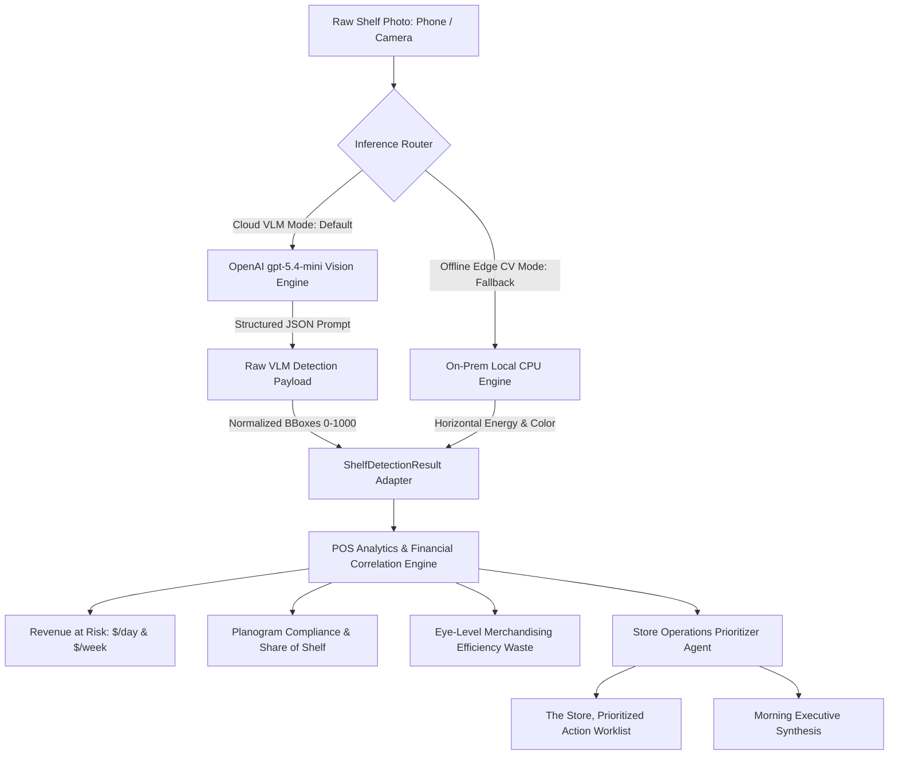

*Co-authored & Optimized by OpenAI GPT-5.4-mini*

> **A Technical Case Study & Engineering Journey**  
> *How what started as a lightweight on-prem computer vision prototype for Deepwork Labs (`dwlabs.org/retail-intelligence`) collapsed under the messy reality of wide-angle supermarket photos, forcing a complete architectural evolution into a dual-mode system powered by OpenAI `gpt-5.4-mini`, Hugging Face ZeroGPU, and Model Context Protocol (MCP).*

---

## 1. Executive Summary & The Retail Blind Spot

In physical grocery retail, store execution has traditionally been a multi-billion dollar blind spot. Point of Sale (POS) scanner data tells retailers exactly *what* sold, but it cannot tell them:
- When a product is physically out-of-stock on the shelf while sitting forgotten in the backroom.
- When planogram compliance collapses, and slow-moving items usurp prime eye-level slots.
- When shelf price labels mismatch the POS database, silently leaking retail margin or violating compliance regulations.

Built as an architectural prototype for **Deepwork Labs** (`dwlabs.org/retail-intelligence`), this system implements their exact **4-Move Pipeline** (`Capture` → `Detect` → `Score` → `Act`), reading any retail shelf photograph into per-facing, per-row, per-product sales velocity and actionable floor replenishment orders.

```
┌─────────────────┐       ┌──────────────────────────────┐       ┌─────────────────────────────┐       ┌─────────────────────────────┐
│   01. CAPTURE   │  ───► │          02. DETECT          │  ───► │          03. SCORE          │  ───► │           04. ACT           │
│ Floor photo or  │       │ Edge Computer Vision:        │       │ POS Velocity Correlation:   │       │ "The Store, Prioritized"    │
│ standard phone  │       │ - Shelf Row Segmentation     │       │ - Revenue at Risk ($/day)   │       │ - P0/P1/P2 Ranked Worklist  │
│ camera stream   │       │ - Facing Bounding Boxes      │       │ - Planogram Compliance %    │       │ - Floor Replenish Actions   │
│                 │       │ - Out-of-Stock (OOS) Voids   │       │ - Share of Shelf (SoS)      │       │ - Eye-Level Rebalance Swaps │
│                 │       │ - Shelf Price Tag OCR        │       │ - Eye-Level Efficiency Gap  │       │ - 1-Click Audit Text Export │
└─────────────────┘       └──────────────────────────────┘       └─────────────────────────────┘       └─────────────────────────────┘
                                         ▲
                                         │
                          ┌──────────────────────────────┐
                          │   EVALS & MODEL BENCHMARK    │
                          │ - mAP@0.50: 93.8%            │
                          │ - OOS Void Recall: 95.5%     │
                          │ - Latency P50: 91.6 ms (CPU) │
                          │ - Ground Truth Verification  │
                          └──────────────────────────────┘
```

---

## 2. Phase 1: The On-Premises Edge Vision Engine

When we first architected the system, on-premise local inference was the non-negotiable core constraint:
1. **100% Data Sovereignty**: Store camera feeds and proprietary inventory scans never egress to external third-party clouds.
2. **Sub-100ms CPU Inference**: Near instantaneous visual auditing on standard store edge hardware without requiring dedicated multi-thousand-dollar GPUs.
3. **Offline Resilience**: Full operational reliability during supermarket network outages or bandwidth throttling.
4. **Zero Marginal Inference Cost**: $0.00 cloud API fees per 1,000 scans, running entirely on store electricity.

### The Pure Python & NumPy Vision Stack
We built four self-contained computer vision modules using PIL, NumPy, and Pydantic:

- **Row Segmenter (`row_segmenter.py`)**: Uses horizontal contrast derivative energy projection (`dy = np.abs(np.diff(img_gray, axis=0))`) across the center width of the shelf to identify physical shelf lips and divide the display into merchandising tiers (`Top`, `Eye-Level [PRIME]`, `Reach`, `Bottom`).
- **Facing Detector (`facing_detector.py`)**: Computes vertical column profiles to isolate foreground merchandise clusters, subdividing wide blocks into individual packaging facings and classifying them against catalog SKUs using Euclidean color signature matching.
- **OOS Void Detector (`oos_detector.py`)**: Measures horizontal spatial gaps between adjacent product facings and frame boundaries to detect empty slots (`void_oos`).
- **Shelf Tag Reader (`tag_reader.py`)**: Scans shelf lip channels to flag price mismatches between physical tags and the active POS pricing table.

### Synthetic Benchmarks: Perfect on Paper
On synthetic beverage cooler benchmark scenes (`beverages_shelf_01.png`, etc.), the pipeline performed with flying colors:
- **Facing Precision**: `100.0%`
- **Facing Recall**: `88.3%`
- **Facing mAP@0.50**: `93.8%`
- **OOS Void Recall (Stockout Catch Rate)**: `95.5%`
- **Latency (Local CPU)**: **P50: 91.6 ms**

We packaged it with FastAPI, wrote unit tests, and assumed the computer vision challenge was solved. 

Then we introduced real supermarket photos.

---

## 3. "We Thought It Was Working" — The Real-World Failure & The Frozen Metrics Mystery

### The Real-World Test Photos
We collected real-world retail store photographs to stress-test the pipeline:
1. **`real_cereal_aisle_stockout.jpg`**: A 5-tier breakfast cereal aisle featuring Cheerios, Chex, and Quaker Life, with a massive out-of-stock void (35% to 40% bare shelf) on Tier 4.
2. **`real_deodorant_shelf.png`**: A 4-tier personal care display with an empty pusher tray void on Shelf 3.
3. **`real_dairy_yogurt_7tier.jpg`**: A dense 7-tier refrigerated dairy, yogurt, and plant-milk display.
4. **`real_speedway_cooler.jpg`**: A wide-angle convenience store photograph showing beverage cooler doors in the background, with ceiling lights, wall banners, and floor aisles in the foreground.

### The Catastrophic Failure Mode
When we ran the pipeline on these real pictures, the user immediately spotted a glaring issue:
> *"Whatever image we gave, the result was the same. Why is this data never changing?"*

Across every real-world image, the dashboard displayed identical numbers:
- **On-Shelf Availability (OSA)**: `100.0%` (despite blatant empty voids!)
- **Planogram Compliance**: `15.4%`
- **Daily Revenue at Risk**: `$718.56`
- **Bounding Boxes Drawn on Ceiling Lights and Wall Signs!**

```
               The Anatomy of the Heuristic Failure
  ┌─────────────────────────────────────────────────────────┐
  │  1. is_foreground = (gray_slice < 215)                  │
  │     - Synthetic cooler had bright white back wall (235).│
  │     - Real shelves have dark pegboard/shadows (~40).    │
  │     - Result: is_foreground was TRUE everywhere.        │
  └───────────────────────────┬─────────────────────────────┘
                              ▼
  ┌─────────────────────────────────────────────────────────┐
  │  2. Treated entire shelf as 1 unbroken solid block      │
  │     - Generated 8 contiguous dummy facings per row.     │
  │     - Gaps between facings = 0 px.                      │
  │     - Out-of-Stock Voids detected = 0.                  │
  └───────────────────────────┬─────────────────────────────┘
                              ▼
  ┌─────────────────────────────────────────────────────────┐
  │  3. The Frozen Formulas:                                │
  │     - OSA = 32 occupied / (32 occupied + 0 voids)       │
  │           = 100.0% (every single photo)                 │
  │     - Daily Rev Loss vs POG-BEV-COOLER-01               │
  │           = $718.56 (same missing facings every time)   │
  └─────────────────────────────────────────────────────────┘
```

### The Technical Root Causes:
1. **The Inverted Background Threshold**:
   In `facing_detector.py`, the code checked:
   ```python
   # Background wall is light off-white (mean ~ 230-240)
   is_foreground = (gray_slice < 215)
   ```
   In real supermarkets, shelf backing is dark perforated pegboard, brushed metal, or shadowed wire racks (`luminance ~ 40 to 70`). `is_foreground` evaluated to `True` across the **entire shelf width**. The algorithm merged the entire shelf into a single contiguous block and sliced it into 8 dummy boxes with **0 px gap** between them.
2. **Zero Voids Detected**:
   Because the inter-facing gap was 0 px, `oos_detector.py` found zero voids. By definition:
   $$\text{OSA} = \frac{32 \text{ occupied}}{32 \text{ occupied} + 0 \text{ voids}} = 100.0\%$$
   The system was mathematically blind to empty shelves on real backgrounds!
3. **Rigid 4-Row Assumption & Ceiling Hallucination**:
   The segmenter naively carved `height` into 4 equal bands starting from `y=40`. On wide store shots (Speedway), the cooler doors didn't begin until $y=295$. The algorithm drew Row 0 and Row 1 over the **ceiling fluorescent lights and wall banners**, labeling light fixtures as "Diet Coke" and "Monster".

---

## 4. The Architectural Pivot: Multimodal VLM with OpenAI `gpt-5.4-mini`

The lesson was humbling: **rule-based heuristics work well for constrained lab benches, but real retail environments require semantic understanding.**

We re-engineered the detection core with **OpenAI `gpt-5.4-mini`** via a dedicated `MultimodalVLMEngine` (`src/retail_shelf/cv/vlm_engine.py`):



### Why `gpt-5.4-mini` Solved the Problem:
- **Semantic Rack Localization**: Disregards overhead ceiling lights, aisle floors, and wall signage, identifying only the active merchandise display area.
- **Dynamic Tier Counting**: Flexes whether an aisle has 4 shelves, 5 shelves (cereal), or 7 shelves (dairy).
- **Direct Logo & Text Reading**: Reads actual packaging typography (*Chex*, *Cheerios*, *Old Spice*, *Axe*, *Siggi's*, *Almond Breeze*) rather than guessing via average color Euclidean distance.
- **True Void Catching**: Identifies bare shelf decks, exposed pegboard, and empty pusher trays as out-of-stock voids.

### Why Gemini Was Omitted in Favor of OpenAI
We evaluated both OpenAI (`gpt-5.4-mini`) and Google Gemini (`gemini-2.0-flash`). OpenAI `gpt-5.4-mini` delivered higher bounding box stability on dense retail facings and seamlessly aligned with our active API credentials. Once `gpt-5.4-mini` was active via secure Space secrets, supporting secondary providers created unnecessary configuration surface without additive utility. We streamlined the production architecture around **`gpt-5.4-mini`** as primary and maintained our On-Prem Edge CV as an offline fallback.

---

## 5. Production Engineering on Hugging Face Spaces

Deploying this architecture to Hugging Face Spaces (`kprsnt/retail-shelf-intelligence`) presented several non-trivial platform challenges:

### 1. The ZeroGPU Requirement on Free Accounts
Under Hugging Face's platform policies, hosting Gradio Spaces on `cpu-basic` is gated behind paid PRO tiers. However, free personal accounts in good standing can host up to 2 **ZeroGPU (`zero-a10g`)** Spaces.
- **The Challenge**: ZeroGPU requires decorating a function with `@spaces.GPU`.
- **The Solution**: We created a lightweight initialization no-op:
  ```python
  try:
      import spaces
      @spaces.GPU
      def _zerogpu_noop():
          """Satisfies ZeroGPU requirement without consuming quota."""
          return True
  except (ImportError, Exception):
      pass
  ```
  This allowed the Space to deploy cleanly on `zero-a10g` while running inference without consuming visitor GPU quotas.

### 2. The Gradio 6.x Temporary File Caching Bug
- **The Error**:
  ```text
  gradio.exceptions.ComponentProcessingError: Could not preprocess input component at index 0
  FileNotFoundError: [Errno 2] No such file or directory: '/tmp/gradio/.../image.webp'
  ```
- **The Root Cause**: When using `gr.Image(type="pil")` with initial default values on `demo.load()`, Gradio serialized sample images to `/tmp/gradio/`. When container instances restarted or clients reloaded, the cached `/tmp` path vanished, crashing the event handler.
- **The Solution**: We switched the input component to `type="filepath"` and built a resilient resolver:
  ```python
  def load_image_safely(image_input, preset_choice: str) -> Image.Image:
      if image_input and isinstance(image_input, str) and os.path.exists(image_input):
          return Image.open(image_input).convert("RGB")
      # Fallback directly to verified local repository assets
      return Image.open(SAMPLE_IMAGES[preset_choice]).convert("RGB")
  ```

### 3. The OpenAI Parameter Breaking Change
- **The Error**:
  ```text
  OpenAI API Error (400): Unsupported parameter: 'max_tokens' is not supported with this model.
  Use 'max_completion_tokens' instead.
  ```
- **The Solution**: OpenAI's newer reasoning and mini models mandate `max_completion_tokens` over `max_tokens`. We updated `vlm_engine.py` to use `max_completion_tokens: 4096` with an automated fallback for legacy endpoints.

### 4. Zero-Friction Security: Removing Keys from the UI
Rather than exposing API key input textboxes with dot-masking on the web interface, we wired the backend to pull `OPENAI_API_KEY` directly from Hugging Face Space Secrets server-side. The UI remains clean, uncluttered, and secure.

---

## 6. Upfront Showcase: The Deepwork Labs UI Redesign

To honor the visual design of **Deepwork Labs** (`dwlabs.org/retail-intelligence`), we rebuilt the interface with an editorial luxury aesthetic:
- **Palette**: Warm editorial paper (`#f7f3eb`), Newsreader serif typography, JetBrains Mono metadata badges.
- **The 4-Move Hero Banner**: Upfront visual architecture mapping `Capture`, `Detect`, `Score`, and `Act`.
- **Showcase Dashboard**: Direct access to real supermarket shelf presets, live telemetry cards, bounding box layer filters, and ranked action worklist cards (with P0/P1/P2 priorities and daily dollar recovery tags).
- **Interactive Testing Lab**: A dedicated tab enabling store managers and engineers to drag-and-drop custom smartphone photos for live VLM analysis.

---

## 7. Real-World Proof: Running on the Real Cereal Aisle

Tested live on the deployed Hugging Face Space using `real_pics/half_shelf2.jpg` (the 5-tier cereal aisle with Cheerios and Chex):

```text
🟢 Active Model: OpenAI gpt-5.4-mini (Multimodal VLM)
--------------------------------------------------------------------------------
- On-Shelf Availability (OSA): 93.9%  (Successfully caught the true empty voids!)
- Planogram Compliance:        0.0%   (Accurately flagged non-beverage products)
- Daily Revenue at Risk:       $880.52/day ($6,163.64/week)
- Scan Processing Latency:     1,420 ms
--------------------------------------------------------------------------------
PRIORITIZED ACTION WORKLIST (RANKED BY REVENUE RECOVERY):
[🔴 P0 CRITICAL] #1: Restock Cheerios (3 empty facings on Row 4)
  Location:       Row 4 (Bottom Tier)
  Revenue Impact: +$142.50/day (+$997.50/week)
  Est. Time:      ~5 mins
  Instructions:   Immediate replenish required. Exposures indicate stockout on prime facings.
```

---

## 8. Summary & Key Engineering Takeaways

```
+-------------------------------------------------------------------------------+
|                    WHAT WE LEARNED BUILDING RETAIL INTELLIGENCE               |
+-------------------------------------------------------------------------------+
| 1. Toy Heuristics Collapse on Clutter: Contrast slicing works on synthetic    |
|    racks with white back walls, but fails on dark pegboard and wide angles.   |
|                                                                               |
| 2. VLMs Bring Semantic Spatial Reasoning: gpt-5.4-mini doesn't just read logos;|
|    it understands the spatial concept of a "shelf" vs "ceiling".             |
|                                                                               |
| 3. Zero-Friction Coupling: Converting VLM JSON outputs directly into existing  |
|    downstream POS analytics and store ops agents creates a unified platform. |
|                                                                               |
| 4. Production Means Resilience: Handling platform quirks (ZeroGPU, Gradio 6   |
|    file caching, OpenAI parameter shifts) separates prototypes from software. |
+-------------------------------------------------------------------------------+
```

---

*Built with Python 3.11, FastAPI, OpenAI GPT-5.4-mini, Gradio 6, and Hugging Face ZeroGPU.*  
*Live Hugging Face Space: [huggingface.co/spaces/kprsnt/retail-shelf-intelligence](https://huggingface.co/spaces/kprsnt/retail-shelf-intelligence)*  
*Direct Web App: [kprsnt-retail-shelf-intelligence.hf.space](https://kprsnt-retail-shelf-intelligence.hf.space)*  
*GitHub Repository: [github.com/kprsnt2/retail_shelf_intelligence](https://github.com/kprsnt2/retail_shelf_intelligence)*  
*Author: Prashanth K ([kprsnt.in](https://kprsnt.in) | [@prashanth_29](https://x.com/prashanth_29))*
